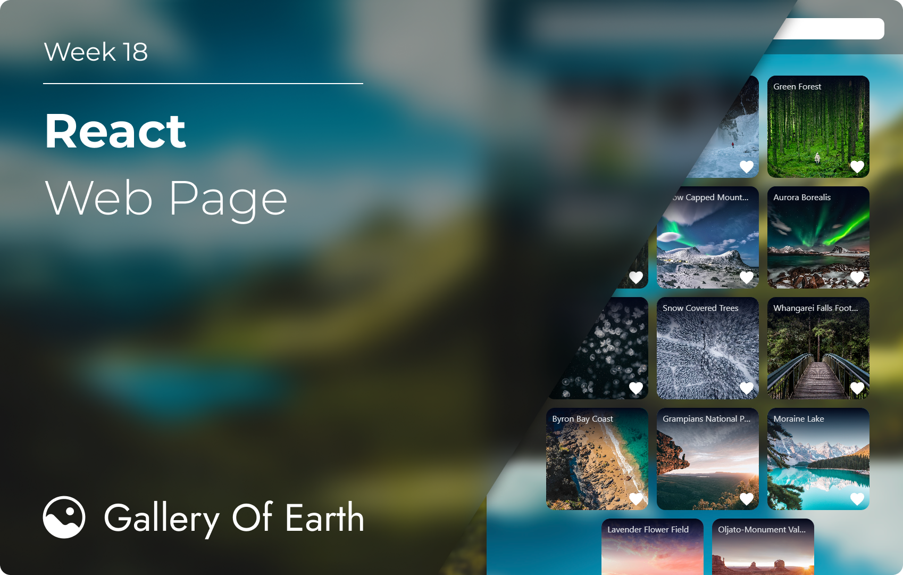

# W18 - React Web Page

## 👋 Greetings!

This is a simple webpage I made called [Gallery Of Earth](https://galleryofearth.netlify.app/), An image gallery site that showcase snippets of the Earth's breath-taking sights and wonders.

## 🔗 Link to Website

### [https://galleryofearth.netlify.app/](https://galleryofearth.netlify.app/)

## 🛠️ Tools
